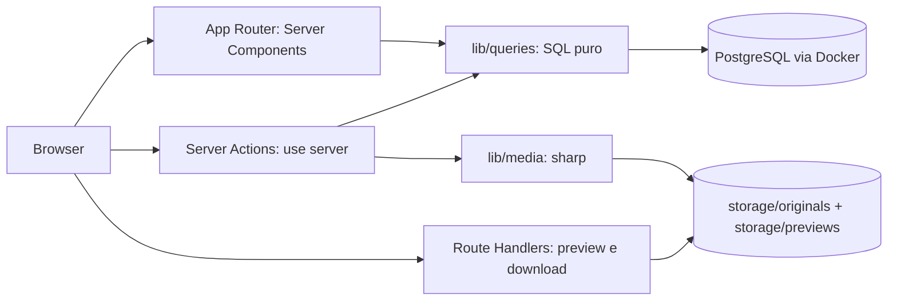
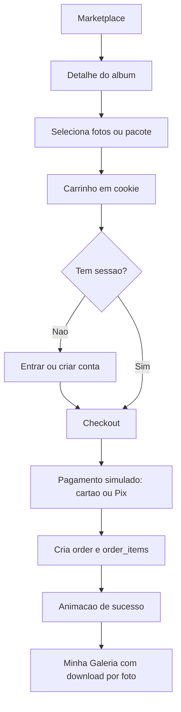

# Corsa: marketplace de fotografia automotiva

## Decisões fechadas

- Unidade de venda híbrida: o **álbum** é o anúncio navegável do marketplace (como no design), e dentro dele o comprador escolhe **fotos individuais** ou leva o **álbum completo com desconto**.
- Acesso a dados em **SQL puro** com `pg`, migrations em arquivos `.sql` versionados.
- Fotos de demonstração baixadas por script de seed para armazenamento local.
- Proteção real de mídia: `sharp` gera preview com marca d'água no upload; original fica fora de `public/` e sai apenas por rota autenticada que valida a compra.
- Escopo inclui as abas **Eventos** e **Fotógrafos**.

## Arquitetura



Regras que seguem a versão instalada do Next (16.3.3): `params` e `searchParams` são Promises, `await cookies()`, guarda otimista em `proxy.ts` (não `middleware.ts`), `revalidatePath` após mutações, `cacheComponents` permanece desligado para manter o código simples.

## Camada de dados

`docker-compose.yml` com `postgres:17-alpine`, volume nomeado e healthcheck. Migrations em `lib/db/migrations/001_schema.sql`, aplicadas por `lib/db/migrate.mts` (executado nativamente por `node --env-file=.env`, sem dependência extra de runner).

Tabelas (valores monetários sempre em centavos inteiros):

- `users`: nome, email único, `password_hash`, `role` (`buyer` | `photographer`), campos de endereço de faturamento, `accepted_terms_at`.
- `photographer_profiles`: `user_id`, `handle` único, bio, avatar, capa, `specialties` (jsonb).
- `events`: nome, slug, `modality` (drift, autódromo, exibição, arrancada), cidade, estado, data.
- `albums`: fotógrafo, evento, título, slug, descrição, `vehicle_type`, `bundle_price_cents`, `published_at`.
- `photos`: álbum, `original_key`, `preview_key`, dimensões, `price_cents`, `taken_at`.
- `tags` + `album_tags`.
- `favorites`: usuário + foto.
- `orders` e `order_items`. Compra de álbum é **expandida em uma linha por foto** com `album_id` preenchido, então o direito de download é sempre por foto e a galeria agrupa por álbum sem regra especial.
- `payouts`: saques simulados do fotógrafo.

Repasse de 85% ao fotógrafo e 15% de taxa da plataforma, coerente com a copy da landing, calculado em consultas de faturamento.

## Organização do código

```
app/
  (public)/     landing, marketplace, marketplace/[slug], eventos, fotografos, carrinho, checkout
  (auth)/       entrar, entrar/fotografo, criar-conta, criar-conta/fotografo
  (buyer)/      minha-galeria, meus-pedidos, minha-conta
  (studio)/     painel, painel/albuns, painel/albuns/[id], painel/faturamento, painel/perfil
  api/fotos/[id]/preview  e  api/fotos/[id]/download
lib/
  db/           client.ts, migrate.mts, seed.mts, migrations/
  queries/      albums.ts, photos.ts, orders.ts, photographers.ts, events.ts, users.ts, payouts.ts
  actions/      auth.ts, cart.ts, checkout.ts, albums.ts, photos.ts, profile.ts, payouts.ts
  auth/         password.ts (scrypt), session.ts (HMAC via node:crypto), current-user.ts
  cart/         cookie-cart.ts
  media/        storage.ts (paths, preview com marca d'água)
  validation/   schemas zod por formulário
  format.ts     moeda e datas pt-BR
components/
  ui/ layout/ marketplace/ cart/ studio/
proxy.ts
```

Cada arquivo de `lib/queries` exporta funções com nome de intenção (`listPublishedAlbums`, `findAlbumBySlug`, `photographerBalance`) contendo SQL parametrizado legível. Um helper enxuto monta o `WHERE` dinâmico dos filtros do marketplace, sem query builder.

Carrinho vive em cookie assinado com a lista de itens (`{ kind: 'photo' | 'album', id }`), resolvido no servidor contra o banco para calcular preços. Funciona para visitante anônimo e sobrevive ao login sem tabela nem merge.

Sessão em cookie `HttpOnly` assinado com HMAC (`node:crypto`), senha com `scrypt`. `proxy.ts` faz apenas a guarda otimista por cookie; a verificação real fica em `current-user.ts`, consumida por cada página privada e por toda Server Action.

## Identidade visual e design system

Tokens em `app/globals.css` via `@theme` do Tailwind v4, com as cores amostradas dos PNGs de referência: vinho profundo da marca e seus estados, areia dos cartões, rosa claro dos painéis, off-white de fundo e tinta quase preta dos títulos. Tipografia: `Rubik` para títulos (formas geométricas de cantos suavizados, equivalente livre ao lettering do design) e `Inter` para texto, ambas via `next/font/google`.

Primitivos em `components/ui`: `Button`, `Field`, `Input`, `Select`, `Checkbox`, `Card`, `Badge`, `Dialog`, `EmptyState`, `SuccessOverlay`. Animações em CSS puro, incluindo o traço do check de sucesso de pagamento e saque. Gráfico de desempenho do painel é um componente SVG próprio de ~30 linhas, sem biblioteca de charts. Ícones com `lucide-react`.

Responsividade mobile-first em todas as telas: header colapsa em menu lateral, sidebar de filtros vira drawer inferior, grades de cartões degradam de quatro para uma coluna, barras de ação de seleção e checkout ficam fixas no rodapé no mobile.

## Estratégia de UX, copy e conversão

- Landing com herói de prova social (uploads diários e eventos cobertos) e CTA duplo que segmenta comprador e fotógrafo desde o primeiro scroll.
- Marketplace com ancoragem de preço: o cartão do álbum mostra o valor do pacote ao lado da soma das fotos avulsas, tornando o desconto tangível.
- Detalhe do álbum com seleção incremental e barra fixa de progresso ("3 fotos selecionadas") mais upsell contextual para o álbum completo, aproveitando o esforço já investido na seleção.
- Favoritar exige conta e é o gatilho de cadastro no pico de interesse, sem bloquear a navegação nem o carrinho.
- Carrinho e checkout com transparência total de taxas, selo de entrega digital instantânea e apenas dois passos numerados, reduzindo ansiedade e abandono.
- Painel do fotógrafo destaca saldo disponível e valor a receber, além de vazio instrutivo que conduz ao primeiro upload.
- Copy em português profissional, direta, sem travessões, sem jargão genérico de IA, escrita como marca de nicho que conhece o público de eventos automotivos.

## Fluxo de compra



## Ajustes de projeto

Adicionar `pg`, `@types/pg`, `sharp`, `zod` e `lucide-react`. Migrar de bun para npm (remover `packageManager` e `bun.lock`, gerar `package-lock.json`). Scripts: `dev`, `build`, `lint`, `db:up`, `db:down`, `db:migrate`, `db:seed` e `setup` (sobe o banco, migra e popula em um comando). `.env.example` com `DATABASE_URL` e `SESSION_SECRET`. `storage/` e `.env` no `.gitignore`. README com o passo a passo de execução local.

O seed cria eventos reais de pista, três fotógrafos com portfólio, álbuns com fotos automotivas livres baixadas e processadas em preview com marca d'água, um comprador com compras concluídas e histórico de saques, para que toda tela abra com conteúdo verossímil.
